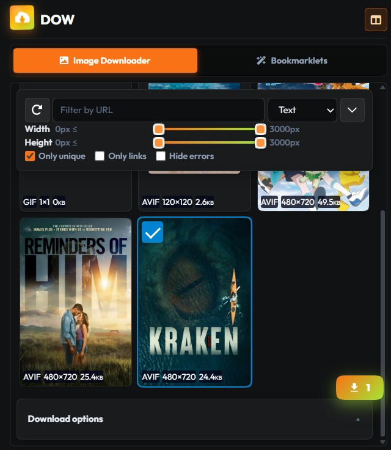
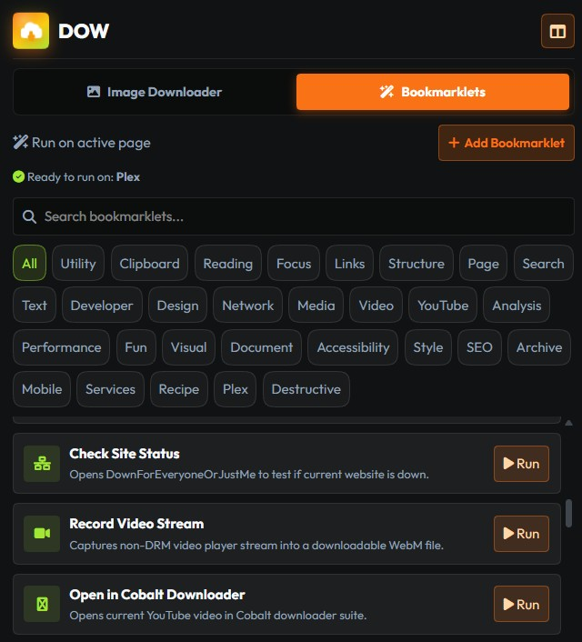

  

<h1 align="center">DOW</h1>

  Bulk image downloader and bookmarklet launcher for Chrome. 
  No backend, no build step, no tracking.

  
  
  
  

| Image Downloader | Bookmarklets |
|---|---|
|  |  |

## Install

1. Download `dow-<version>.zip` from the
   [latest release](https://github.com/infinition/dow/releases/latest) and unzip it.
2. Open `chrome://extensions` and enable **Developer mode** (top right).
3. Click **Load unpacked** and select the unzipped folder.

The toolbar icon opens the popup. The icon next to the header docks the same interface as
a side panel.

## Features

**Image Downloader**

- Collects every image on the page, including those inside iframes.
- Filters by URL substring, by width and height ranges, and by file type.
- Deduplicates variants of the same image before listing them.
- Batch download with custom subfolder and filename rules.
- Rebuilds a proper filename when a site serves images without one, instead of letting
  Chrome save them all as "unnamed".

**Bookmarklets**

- Ready-made catalog: reading focus, outline headings, show link URLs, allow right-click
  and text selection, QR codes, Wayback Machine lookup, picture-in-picture, and more.
- Run any of them on the active tab in one click.
- Add your own, with tags. Import those already sitting in your bookmarks bar.

## Permissions

| Permission | Why it is needed |
|---|---|
| `activeTab`, `scripting` | Scan the current page for images, and run bookmarklets in it |
| `downloads` | Save the selected images, and shape their filenames |
| `storage` | Remember your filters, options, and custom bookmarklets |
| `tabs` | Refresh the image list when you switch or reload a tab |
| `sidePanel` | Offer the docked side-panel view |
| `<all_urls>` | Work on any site you explicitly open the extension on |

DOW never watches your browsing. It registers no `webRequest` listener, sends nothing to
any server, and injects its content script only when you open it on a page.

## Contributing

See [CONTRIBUTING.md](CONTRIBUTING.md) for the project layout, the styling constraints,
and how builds and releases work.

## License

MIT. See [LICENSE](LICENSE).
